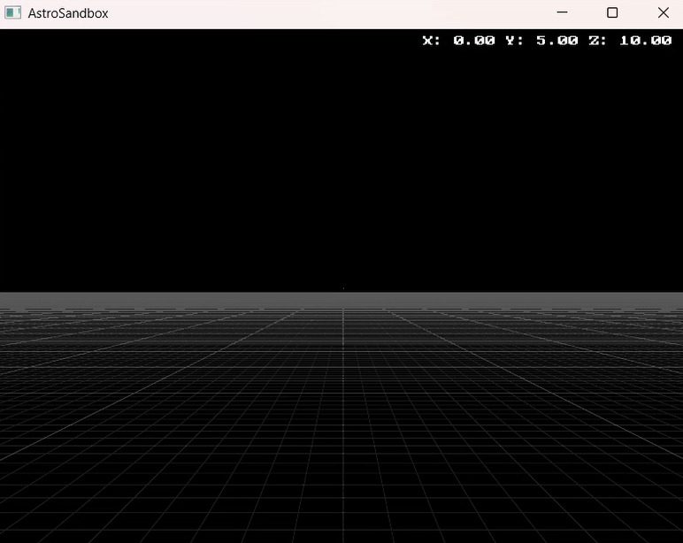
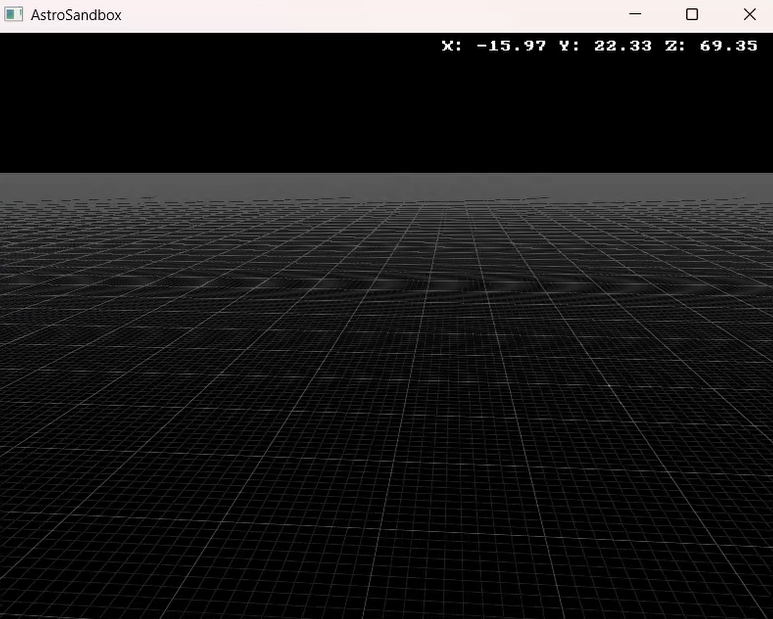
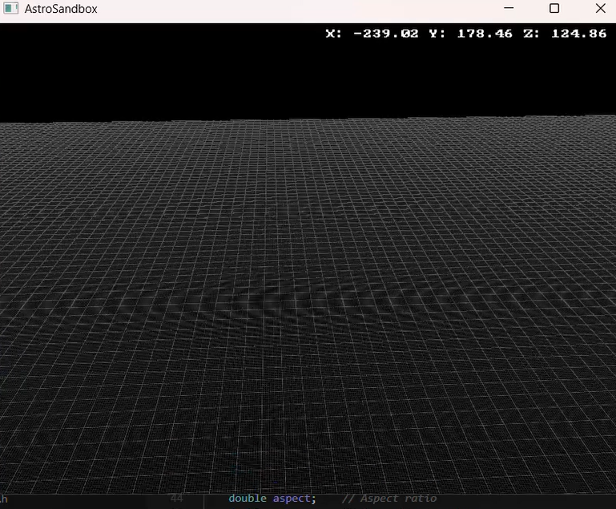

# Project Progress

## Project Overview
AstroSandbox is a 3D space simulation project that aims to provide an interactive environment for visualizing and experimenting with space physics concepts. The project uses OpenGL for rendering and implements a custom physics engine for space simulations.

## Demo Video
Check out the [Coordinate System Demo](demo_samples/Coordinate%20System%20Demo.mp4) to see the current implementation in action.

## Completed Features

### Build System
- [x] CMake project setup
- [x] GLFW library integration (MinGW build)
- [x] Build scripts automation
- [x] Cross-platform compatibility
- [x] FreeType integration for text rendering

### Core Components
- [x] Vector class implementation
- [x] Basic physics simulation framework
- [x] OpenGL rendering setup
- [x] Window management
- [x] Basic camera system
- [x] Grid system with coordinate axes
- [x] Responsive window and viewport
- [x] Camera movement relative to facing direction
- [x] Delta time for consistent movement speed
- [x] Sprint functionality (Left Shift)
- [x] Cursor toggle (C key)
- [x] Text rendering system
- [x] Basic shader implementation

### Project Structure
- [x] Organized directory layout
- [x] Header/source separation
- [x] Library management
- [x] Build output organization
- [x] Resource management (fonts, shaders)

## In Progress

### Physics Engine
- [ ] Advanced gravity calculations
- [ ] Collision detection
- [ ] Multiple body interactions
- [ ] Orbital mechanics
- [ ] Time dilation effects

### Graphics
- [ ] Textures for celestial bodies
- [ ] Lighting system
- [ ] Particle effects
- [ ] Improved camera controls
- [ ] Post-processing effects
- [ ] Skybox implementation

### User Interface
- [ ] Simulation controls
- [ ] Time manipulation
- [ ] Debug visualization
- [ ] Parameter adjustment
- [ ] HUD for simulation data
- [ ] Settings menu

## Planned Features

### Performance
- [ ] Spatial partitioning
- [ ] Multithreading support
- [ ] Level of detail system
- [ ] Rendering optimizations
- [ ] GPU acceleration for physics

### Additional Features
- [ ] Save/Load functionality
- [ ] Multiple simulation scenarios
- [ ] Sound effects
- [ ] Tutorial system
- [ ] Export/Import of simulation data
- [ ] Network multiplayer support

## Known Issues
- None currently tracked

## Next Steps
1. Implement advanced physics calculations
2. Add basic UI controls
3. Improve rendering quality
4. Add save/load functionality
5. Implement particle systems for visual effects

## Contributing
We welcome contributions! Please check the README.md for contribution guidelines and the current development status in this file.

## Current Implementation Screenshots

*Current implementation of the 3D coordinate system with grid*

*Interactive camera movement demonstration*

*Text rendering and UI elements implementation* 