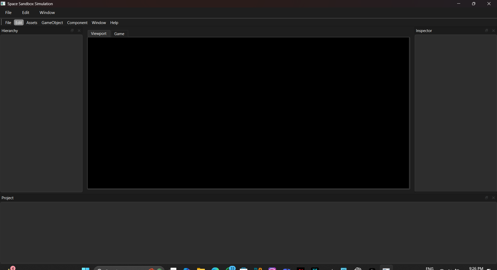
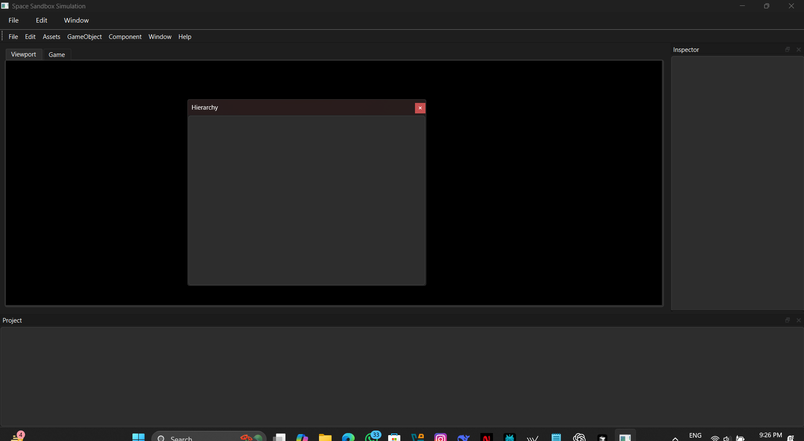
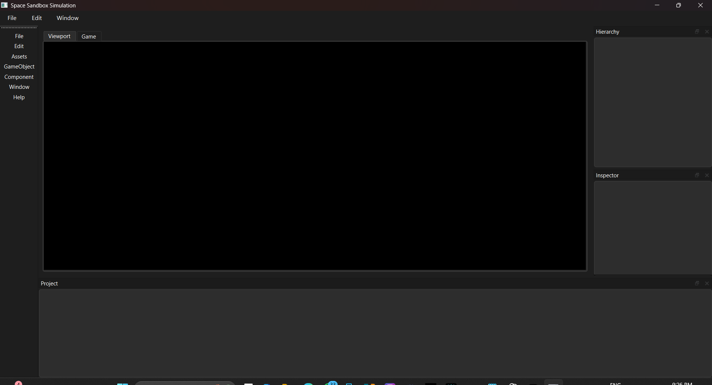

# Space Sandbox Simulation

A powerful space simulation sandbox built with C++ and Qt6, featuring realistic physics, customizable interfaces, and interactive 3D visualization.

## Features

Not implemented 1st 2nd and 4th
- **Realistic Physics Simulation**
  - N-body gravitational calculations
  - Collision detection and response
  - Orbital mechanics
  - Customizable simulation parameters

- **Interactive 3D Visualization**
  - OpenGL-based rendering
  - Real-time camera controls
  - Celestial body visualization
  - Trajectory plotting

- **Customizable Interface**
  - Dockable windows
  - Resizable panels
  - Tab-based organization
  - User-defined layouts

- **Advanced Controls**
  - Real-time parameter adjustment
  - Simulation speed control
  - Camera manipulation
  - Body property editing

## Demo Samples

The project includes several demo samples showcasing different features. These images are located in the `demo_samples` directory of the repository.

### Default Window

- Standard application layout
- Basic window configuration
- Default control placement

### Dockable Windows

- Demonstrates docking system
- Panel arrangement examples
- Tab management

### Customizable Windows

- Custom layout examples
- Theme variations
- Control panel configurations

> Note: If the images are not displaying, please ensure you have cloned the repository and are viewing the README from the local repository. The images are stored in the `demo_samples` directory.

## Getting Started

### Prerequisites

- Windows 10 or later
- CMake 3.10+
- MinGW-w64 (GCC 14.2.0+)
- Qt6 (6.9.0)
- Git

### Installation

1. Clone the repository:
   ```bash
   git clone https://github.com/yourusername/Space-Sandbox-Simulation.git
   cd Space-Sandbox-Simulation
   ```

2. Run the setup script to download dependencies:
   ```bash
   .\setup.bat
   ```

3. Build the project:
   ```bash
   .\build.bat
   ```

4. Run the project:
   ```bash
   .\run.bat
   ```

## Documentation

- [Project Overview](docs/ProjectOverview.md) - Detailed project architecture and features
- [User Guide](docs/UserGuide.md) - Usage instructions and features
- [Development Guide](docs/DevelopmentGuide.md) - Development setup and guidelines

## Contributing

1. Fork the repository
2. Create your feature branch
3. Commit your changes
4. Push to the branch
5. Create a Pull Request

## License

This project is licensed under the MIT License - see the [LICENSE](LICENSE) file for details.

## Acknowledgments

- Qt6 for the GUI framework
- OpenGL for 3D rendering
- GLM for mathematics
- GLFW for window management
- ImGui for immediate mode GUI 
