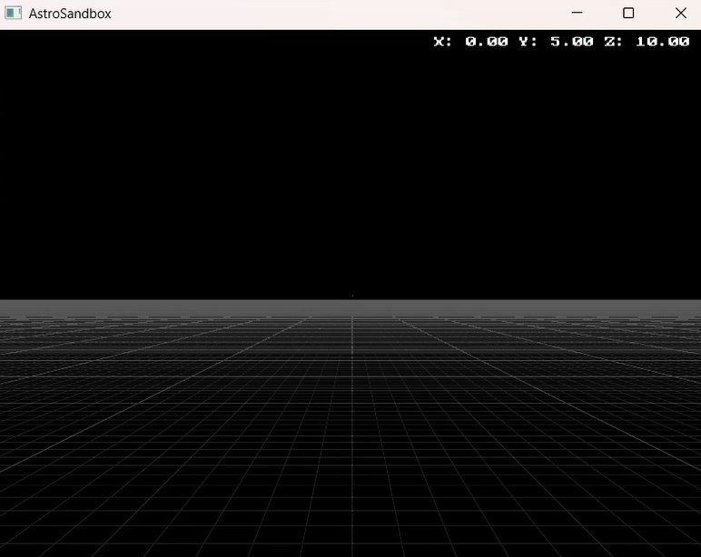
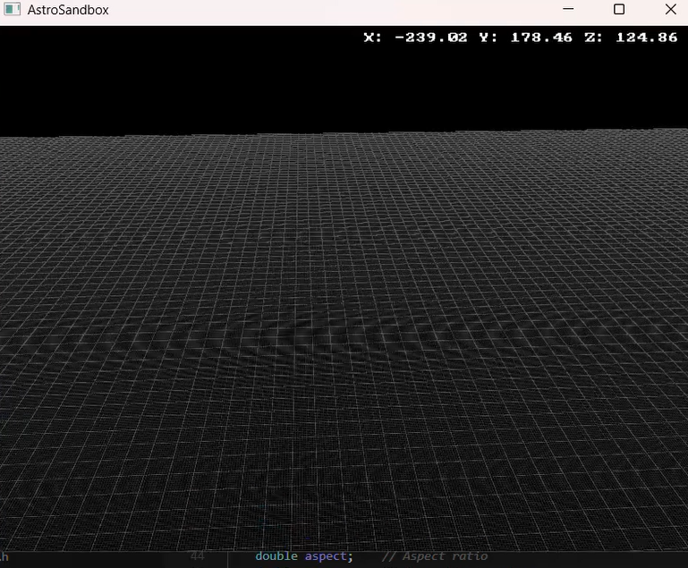

# AstroSandbox

A lightweight space simulation project that demonstrates basic orbital mechanics and 3D rendering using OpenGL. This project provides an interactive 3D environment for visualizing and experimenting with space physics concepts.

## Demo Video

Check out the [Coordinate System Demo](demo_samples/Coordinate%20System%20Demo.mp4) to see the project in action, showcasing the 3D coordinate system, camera controls, and basic rendering features.

## Project Structure
```
Space-Sandbox-Simulation/
├── build/           # Build output directory
├── include/         # Header files
├── lib/            # Libraries (GLFW, etc.)
├── src/            # Source files
├── shaders/        # GLSL shaders
├── tests/          # Test files
├── docs/           # Documentation
├── fonts/          # Font files for text rendering
└── demo_samples/   # Demo videos and screenshots
```

## Features

- 3D coordinate system visualization
- Interactive camera controls
- Grid system with customizable dimensions
- Text rendering support
- Responsive window management
- Delta time-based movement
- Sprint functionality
- Cursor toggle for better control

## Building and Running the Project

### Windows

1. Clone the repository:
```bash
git clone <repository-url>
cd Space-Sandbox-Simulation
```

2. Build dependencies:
```bash
.\build_glfw.bat
```

3. Build the project:
```bash
.\build.bat
```

4. Run the simulation:
```bash
.\build\astro-sim.exe
```

That's it! The project is now ready to run. All necessary dependencies are included in the repository.

## Controls

- WASD: Move forward/backward, strafe left/right
- Space: Move up
- Left Control: Move down
- Q : Decrease Movement Speed
- E : Increase Movement Speed
- Left Shift: Hold to sprint (move faster)
- Mouse: Look around (when cursor is hidden)
- C: Toggle mouse cursor visibility
- ESC: Exit

## Dependencies

All dependencies are included in the repository:
- GLFW 3.4
- GLM
- OpenGL 3.3+
- GLAD
- FreeType (for text rendering)

## Development Progress

See [PROGRESS.md](PROGRESS.md) for detailed development status and planned features.

## Contributing

1. Fork the repository
2. Create your feature branch
3. Commit your changes
4. Push to the branch
5. Create a Pull Request

## License

This project is licensed under the [MIT License](LICENSE.txt) - see the LICENSE file for details.

## Screenshots

Here are some screenshots showcasing the project's features:


*3D Coordinate System with Grid*


*Interactive Camera Movement*


*Text Rendering and UI Elements* 